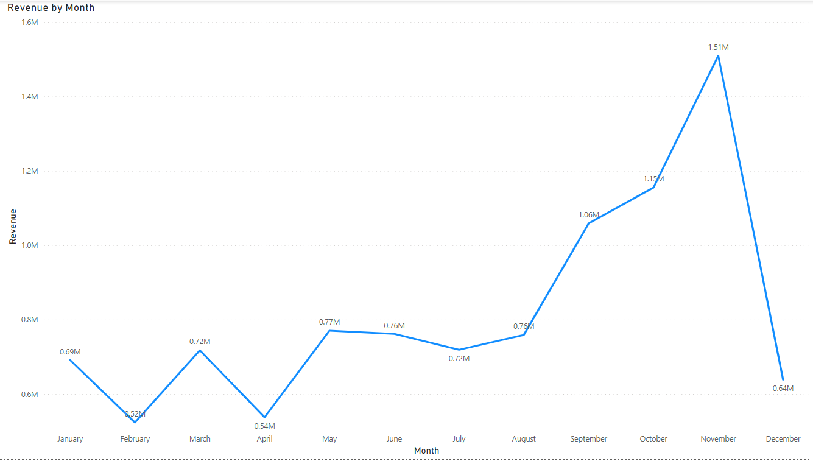
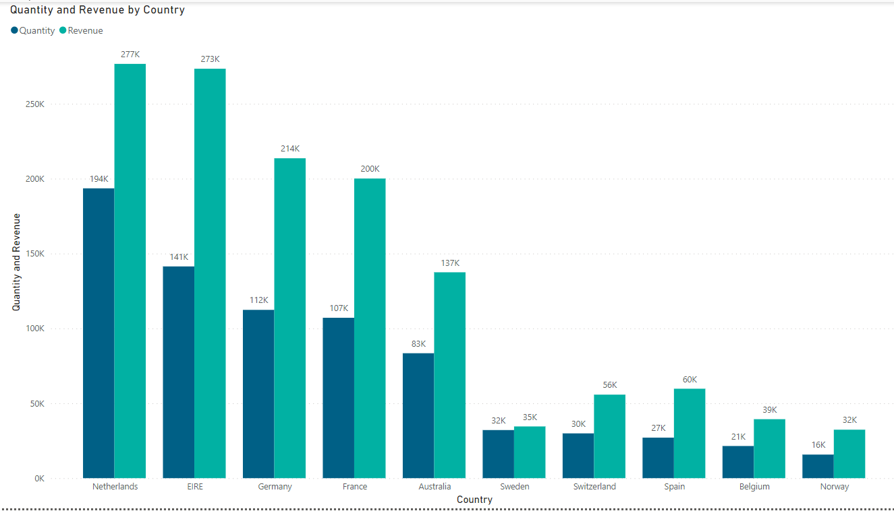
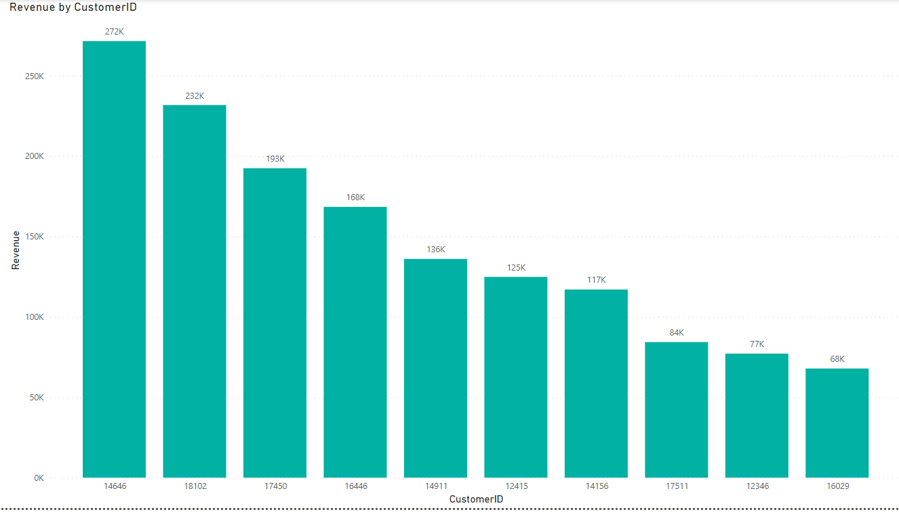
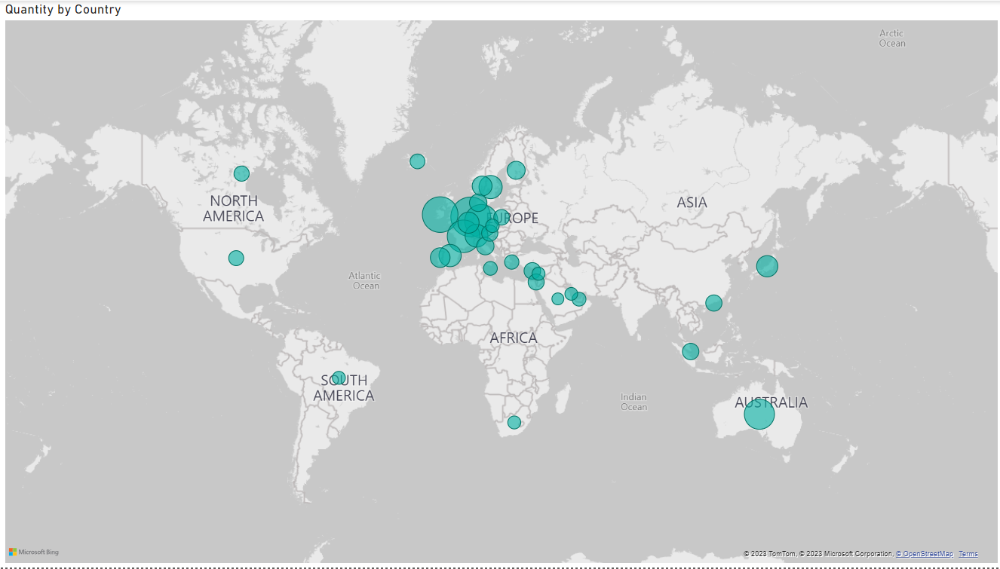

# TATA-Internship
This repository is the collection of all the tasks I performed during the virtual internship in data analysis

# Problem definition
An online retail store has hired you as a consultant to review their data and provide insights that would be valuable to the CEO and CMO of the business. The business has been performing well and the management wants to analyse what the major contributing factors are to the revenue so they can strategically plan for next year.

The leadership is interested in viewing the metrics from both an operations and marketing perspective. Management also intends to expand the business and is interested in seeking guidance into areas that are performing well so they can keep a clear focus on what’s working. They would also like to view different metrics based on the demographic information that is available in the data.

A meeting with the CEO and CMO has been scheduled for next month and you need to draft the relevant analytics and insights that would help evaluate the current business performance and suggest metrics that would enable them to make the decision on expansion.

## TASK 1

- Draft questions that you think will be important and relevant to the CEO and CMO.
- Make sure to think both quantitatively and qualitatively.
- Create a set of four questions that you anticipate each business leader will ask and want to know the answers to. Make sure you differentiate your questions, as both the CEO and CMO view business decisions through different lenses.

## Solution for TASK 1
### Questions of interest to the CEO
 1. Which region is generating the highest revenue, and which region is generating the lowest?
 2. What is the monthly trend of revenue, which months have faced the biggest increase/decrease?
 3. Which months generated the most revenue? Is there a seasonality in sales?
 4. Who are the top customers and how much do they contribute to the total revenue? Is the business dependent on these customers or is the customer base diversified?

### Questions of interest to CMO
 1. What is the percentage of customers who are repeating their orders? Are they ordering the same products or different?
 2. For the repeat customers, how long does it take for them to place the next order after being delivered the previous one?
 3. What revenue is being generated from the customers who have ordered more than once?
 4. Who are the customers that have repeated the most? How much are they contributing to revenue?

## TASK 2
 - Provide visuals on the metrics that they wish to analyse for the online retail store.
 - The senior management wants to understand how their business is performing and what areas are the key strengths of the company.
 - They are also focused on identifying opportunities that would lead to growth and generate more revenue in the future.

## Solution for TASK 2

### Step 1 :Data cleanup 
It is noticed that the data contains some returns to the store which are provided in negative quantities and there are unit prices which were input in error.Following steps are performed to clean this data.
- Created a check that the quantity should not be below 1 unit. 
- Created a check that the Unit price should not be below $0.

  In order to apply the checks that have been mentioned above, conditional formulas are used where the logic would state that if the conditions are met then the tool should exclude the data from analysis.  Data transformation methods are also used  to get rid of the bad data. Once this is done, the data will be good to be used for further analysis.

### Step 2 :Creating Visuals in POWERBI for all the questions / requirements put up by the user

### Question 1
The CEO of the retail store is interested to view the time series of the revenue data for the year 2011 only. He would like to view granular data by looking into revenue for each month. The CEO is interested in viewing the seasonal trends and wants to dig deeper into why these trends occur. This analysis will be helpful for the CEO to forecast for the next year.

### Question 2
The CMO is interested in viewing the top 10 countries which are generating the highest revenue. Additionally, the CMO is also interested in viewing the quantity sold along with the revenue generated. The CMO does not want to have the United Kingdom in this visual.

### Question 3
The CMO of the online retail store wants to view the information on the top 10 customers by revenue. He is interested in a visual that shows the greatest revenue generating customer at the start and gradually declines to the lower revenue generating customers. The CMO wants to target the higher revenue generating customers and ensure that they remain satisfied with their products.

### Question 4
The CEO is looking to gain insights on the demand for their products. He wants to look at all countries and see which regions have the greatest demand for their products. Once the CEO gets an idea of the regions that have high demand, he will initiate an expansion strategy which will allow the company to target these areas and generate more business from these regions. He wants to view the entire data on a single view without the need to scroll or hover over the data points to identify the demand. There is no need to show data for the United Kingdom as the CEO is more interested in viewing the countries that have expansion opportunities.

All the above requirements of the user are generated as a POWERBI report.Plz refer to the attached pbix file in the git hub page.

